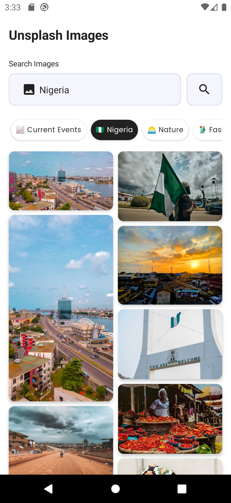

## Unsplash-API-Compose 

A project to display images from https://unsplash.com API using Jetpack Compose

## Features

* Jetpack Compose
* Compose Coil
* MVI Architecture
* Kotlin Coroutines with Flow
* Dagger Hilt
* Kotlin Gradle DSL
* Paging
* Compose Blurhash

 

## Libraries

- [Jetpack Compose](https://developer.android.com/jetpack/compose) - Android’s modern toolkit for
  building native UI.
- [Compose Coil](https://coil-kt.github.io/coil/compose/) - An image loading library for Android
  backed by Kotlin Coroutines.
- [View Model](https://developer.android.com/topic/libraries/architecture/viewmodel) - Presenter for
  persisting view state across config changes
- [Retrofit](https://square.github.io/retrofit/) - type safe http client and supports coroutines out
  of the box.
- [Moshi](https://github.com/square/moshi) - JSON Parser,used to parse requests from the API
- [kotlinx.coroutines](https://github.com/Kotlin/kotlinx.coroutines) - Library Support for
  coroutines
- [Paging](https://developer.android.com/jetpack/androidx/releases/paging) - The Paging Library
  makes it easier for you to load data gradually and gracefully within your app
   
- [Compose Blurhash](https://github.com/dalafiarisamuel/composeblurhash) - is a library that has
  blurred effect until the actual image gets downloaded from the web.

## Prerequisite

* To successfully make API calls to Unsplash Endpoint, use a valid API Token from Unsplash.
* Enter your valid API token [here](./app/src/main/java/ng/devtamuno/unsplash/compose/env/Env.kt)

## App Screenshots

 

